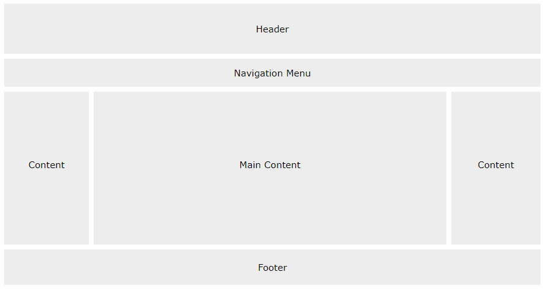
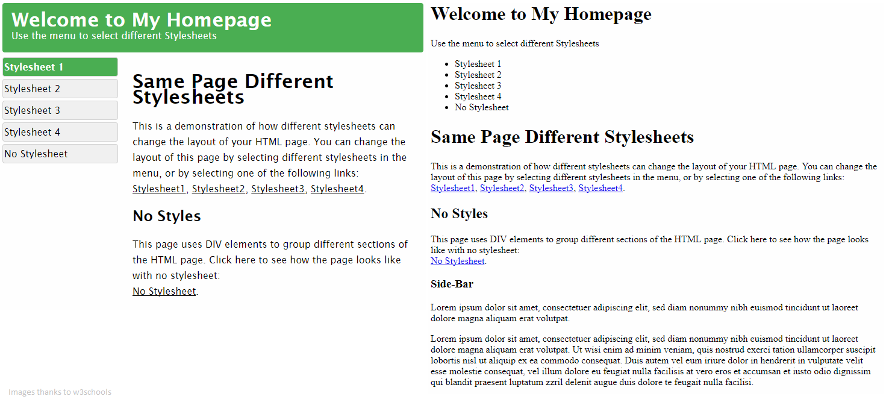

# TAMU WEBGIS
>

# Learning Objectives
>
- Be able to define and recognize CSS
- Describe CSS syntax
- Import an external CSS file
- Obtain basic knowledge of important CSS properties

# CSS
<!-- How to view CSS online -->
**Cascading Style Sheets**, or CSS, is a style language that describes how HTML documents should be presented to the user. That's just a long way of saying that it makes websites pretty and easy on the eyes. 
<!-- Generally, most websites nowadays follow a website layout pattern similar to what you see below:
>

#####
>
TEXT GO HERE -->
>

##### This example highlights the importance of CSS
>
# CSS Syntax 
CSS syntax is rather simple as it is comprised of two parts: the selector and the declaration. Selectors in CSS describe who is receiving the style defined in the declaration; in a way they "find" which HTML element you wish to style. There are several selectors you can use to pinpoint the HTML element you wish to style but we'll be focusing on the main three: elements, classes, and ids. An element selector contains just the element tag you wish to select such as **p** or **div** followed by the declaration portion of the style. An id selector contains the targeted id HTML attribute value preceded by the hash / pound sign. Lastly, the class selector uses a period then the class name to target HTML elements with said class.
>
Example | Selector | Selects
--- | --- | --- 
**p** { color: black; } | **p** | all \<p>'s
**div** { background-color: blue; } | **div** | all \<div>'s
**#subtitles** { color: lightgrey; } | **#subtitles** | element with id 'subtitles'
**.userName** { text-align: left; } | **.userName** | elements with class 'userName'
**p.center** { color: black; text-align: center; } | **p.center** | \<p>'s with class 'center'
##### Example of different types of selectors
>
The CSS declaration is the part that procedes the selector and lists all the CSS properties that will be applied to the selector. Declarations can be broken up into two parts: the property and the value. The property is a reserved CSS keyword used to indicate a specific style to be applied. The value determines how the particular property style will be displayed. An example of this is show below.
```css
h1 {
    color: blue;
    font-size: 12px;
}
```
In the style above for the **h1** selector, there are two declarations. The first declaration is the property **color** which changes the text color of the selector to the given value **blue**. The second declaration uses the **font-size** property to adjust, you guessed it, the font size of the selector to value **12px**.


# How to apply CSS
Many different CSS styles can be applied to a single HTML page, not just a single CSS page. Some sites online utilize many different CSS sheets to create their unique look. One of the many ways you can apply CSS to your HTML pages is by using inline styles. This method, though available, is **NOT** a smart way of applying CSS as it makes finding styles harder if you ever need to change them; you lose many of the advantages of CSS. Inline CSS is great for the inital stage of web site design and production, but after that stage you should really use one of the two other options. 
```css
<!-- EXAMPLE OF INLINE STYLING -->
<p style="background-color: blue;"></p>
```
The second method for applying CSS is with an internal style sheet. We can define an internal style sheet by using the **style** tag inside a plain HTML document. Within the **style** tag we put plain ol'CSS and let the browser worry about applying said styles. Please note that styles defined here are limited in scope to the HTML file they're written; you cannot use this style elsewhere unless you happen to have another internal style sheet that has these contents. Copying and pasting the same styles over and over constantly adding can be tiresome. 
```css
<!-- EXAMPLE OF INTERNAL STYLING -->
<html>
    <head>
        <script>
            body {
                background-color: lightgray;
            }
            h1 {
                color: #500000;
                padding-left: 16px;
            }
        </script>
    </head>
    <body>

    </body>
</html>
```
That is why the last way, external style sheets, are the prefered method for applying CSS styles. With an external style sheet you can have a single source of style that you can apply across all your HTML pages, creating a singular design for your site. We can define a new file with the **.css** extension, put all our CSS styles inside, then reference the **.css** file in any HTML file we choose. This allows us to then utilize these styles across many pages reducing work required and easily impose a particular design to your entire site with ease. 
```css
<!-- EXAMPLE OF EXTERNAL STYLE SHEET -->
<!-- main.css -->
body {
    background-color: lightgray;
    align-content: center;
}
h1 { 
    color: #500000;
    padding-left: 16px;
}
```
```html
<!-- EXAMPLE OF USING EXTERNAL STYLE SHEET -->
<!-- main.html -->
<html>
    <head>
        /* important line; imports external style sheet */
        <link rel="stylesheet" type="text/css" href="path/to/file/main.css">
    </head>
    <body>
        <h1>Fresh Prince of Belair</h1>
    </body>
</html>
```
We use the `<link rel="stylesheet" type="text/css" href="path/to/file/main.css">` line to import an external style sheet to our HTML page. At this point we now have access to the styles defined inside the external style sheet.


>
# Good learning resources
Great discussions of CSS can be found below.
> Dribbble: http://dribbble.com
> There is some adult language on the following websites, but if you get into web sites 
and design, you will eventually learn to appreciate their content.
> - http://motherfuckingwebsite.com/
> - http://bettermotherfuckingwebsite.com/
> - https://thebestmotherfucking.website/


## Questions

## [Set 1](../reviewquestions/10.md)

## Videos
[Video 10.1 - 2018-02-07](https://youtu.be/VaLmWy2eLmk) - Video cuts out at 20 mins, goes way longer, trim
