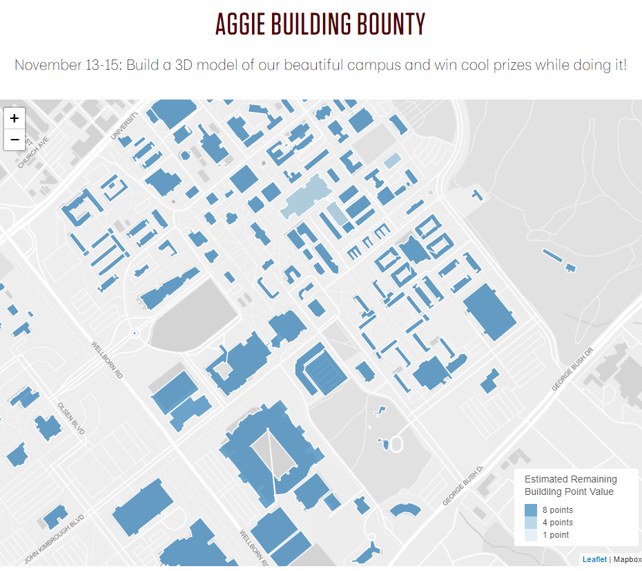

# TAMU WEBGIS
>

# Learning Objectives
>
- Describe the purpose of REST interfaces
- Enumerate the types of REST verbs (GET/POST/DELETE)
- Pull GIS data from REST interfaces
- Display GIS data on web maps from REST interfaces
# REST
REST, or Representational State Transfer, is a communications protocol which outlines a way of getting information from a backend server. We use REST as a means of getting information for a website, be it a website we control or a website out there in the wilderness that has information we want to pull from.
# REST methods
## GET
GET retrieves information from the REST endpoint. Must return the same value over and over if given the same parameters. Parameters passed in GET are included in the query string and are visible. Do not use passwords in a GET.
## POST
POST includes data on the request. The REST endpoint then uses the data provided to either limit the data asked, login with the provided credentials, update an entity, or many other things. Unlike GET, POST parameters are inside the body of the query and are not part of the query string.
## DELETE
DELETE is used to delete a specific resource given a specific identifying parameter.
>
# Pulling GIS data
We can get data from REST in a multitude of ways. Below I will describe just one of many to get data from a REST interface using the GET method. We define the REST endpoint we wish to grab data from with the variable **pathToRest**. After we define the endpoint, we then create a new XMLHttpRequest object named **request**. This variable is what we will use to go and grab the data from our **pathToRest** endpoint. In the code below the **request** declaration, we then set the event listener for **request** called **onreadystatechange**. This function will be triggered whenever the state of **request** changes. It will fire multiple times as the **request** goes and grabs the data. Below this we have a variable **formData** of type **FormData**. This is used if we were sending data to the REST endpoint to limit what data it returns. We're using GET so we won't be sending any data this time, but if you were, you would put the data inside **formData**. With **request** we then call it's **open** method which creates the connection given a specific REST method and REST URL. The **true** parameter is telling Javascript that our REST call will be asynchronous. We then call **send** to send the request to the REST endpoint and get our data. Once we have data to return the **onreadystatechange** is fired again. We check to see if the **request.status** is a success (200) and then we print the resulting data to the console.
>
```javascript
var pathToRest = "http://gisday.tamu.edu/Rest/Buildings/Map/Get/Default.aspx";
var request = new XMLHttpRequest();
request.onreadystatechange = (e) => {
    if (request.readyState !== 4) {
        return;
    }
    if (request.status === 200) {
        console.log(e.target.repsonse);
        markerCallback(e.target.response);
    }
}
var formData = new FormData();
request.open('GET', pathToRest, true);
request.send(formData);
```
# Displaying GIS data
Using the above method to pull data, we can use the below method to map the resulting data from our REST endpoint.
>
We parse the GeoJSON returned by the server and for each **Feature** object, in this case a building, we call the **onEachFeature** local function passing in two parameters: feature and layer. Here we can assign a click event listener to our building and have that listener print to the console the layer details. After we set any event listeners, we then style our **Feature** before we add it to a single **GeoJSON** layer. We style our buildings depending on some property found inside that **Feature**'s **properties**. Using the **Feature**'s number of entries, we then send that to a function which returns a different color depending on the number of entries. After all of our buildings are processed and colored, we then finish by adding the single **GeoJSON** layer to our map for viewing.
```javascript
function markerCallback(json) {
    L.geoJSON(JSON.parse(json), {
                onEachFeature: function(feature, layer) {
                    layer.on('click',
                        function(e) {
                            console.log(e);
                        });
                },
                style: function(feature) {
                    var entries = feature.properties.Entries;
                    var buildingNumber = feature.properties.BuildingNumber;
                    return {
                        fillColor: getColor(entries),
                        weight: 1.5,
                        color: 'white',
                        fillOpacity: 0.7
                    }
                }
    }).addTo(map);
}
function getColor(d) {
    return (d >= 0 && d < 5) ? '#3182bd' :
        (d >= 5 && d < 20) ? '#9ecae1' :
        '#deebf7';
}

```
>

> Example: http://gisday.tamu.edu/sfmmap/


# Additional resources
- https://spring.io/understanding/REST
- http://leafletjs.com/examples/geojson/
- https://developer.mozilla.org/en-US/docs/Web/API/XMLHttpRequest
- https://developer.mozilla.org/en-US/docs/Web/API/XMLHttpRequest/Using_XMLHttpRequest

# Questions
[Set 1](../reviewquestions/16.md)


## Videos
[Video 1 - 2018-02-23](https://youtu.be/M9UpjYPlvHM) starts at 39 mins
[Video 2 - 2018-02-23](https://youtu.be/N0splCS518g) starts at 39 mins