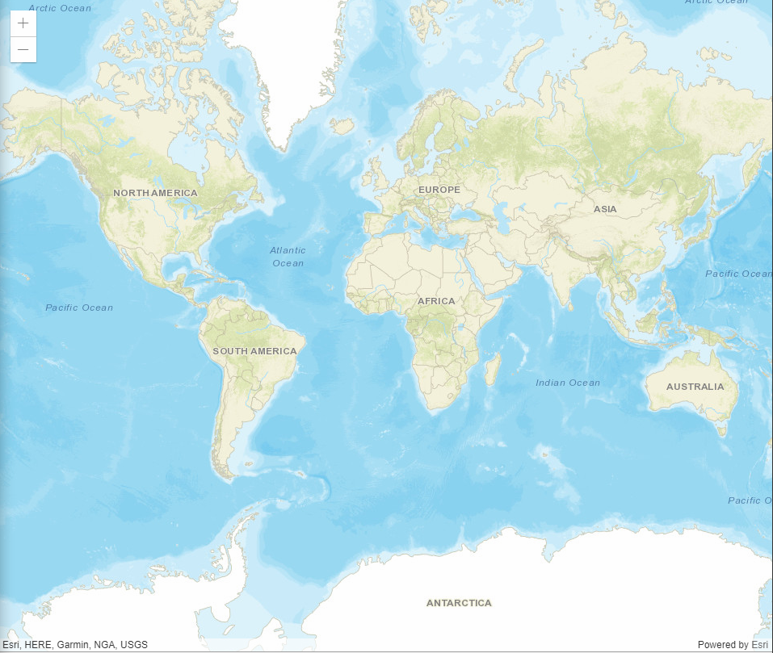
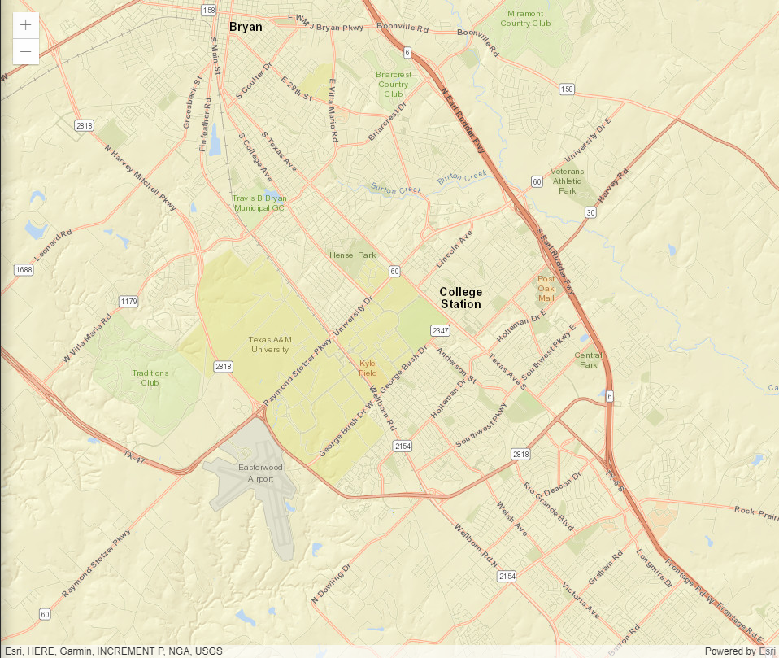
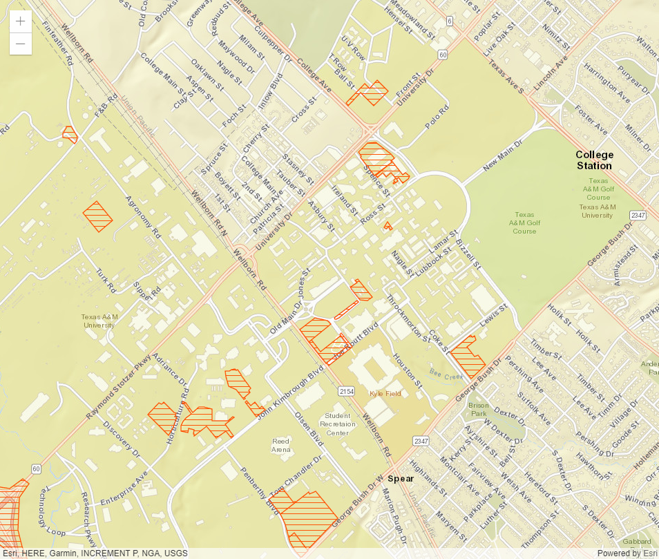
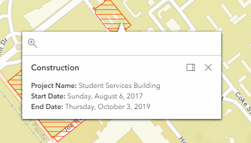

# TAMU WEBGIS
>

# Learning Objectives
>
- Explain the Dojo loading process
- Add basemaps
- Incorporate feature layers
- Layer control - Turning layers on/off
- Creating popup templates
# ArcGIS API for Javascript
ArcGIS API for Javascript, or ESRI JS as I shall hence forth refer to it, is ESRI's foray into the world of Javascript mapping libraries. ESRI JS "lets you build full-featured 3D applications powered by web scenes that include rich information layers such as terrain, basemaps, imagery, features, integrated mesh layers, and 3D objects". Unlike most ESRI products it is fairly simple to setup and get started.
>
# Getting started
To get started with ESRI JS, all you need to do is add the following lines to your HTML's header and you're ready to go! What these lines do is add the network distributed version of ESRI JS (CDN) to your HTML page giving you access to ESRI JS just as if you had downloaded a copy locally.
>
```javascript
<link rel="stylesheet" href="https://js.arcgis.com/4.6/esri/css/main.css">
<script src="https://js.arcgis.com/4.6/"></script>
```
>
# Basic ESRI JS map
## Our HTML
We start with a basic HTML page to structure our web map. We'll add in ESRI JS's CDN in our header along with our own Javascript file, then add a container **mapid** which will contain our MapView. We'll also call a starting function in our Javascript called **main()**.
```html
<html>
    <head>
        <link rel="stylesheet" href="https://js.arcgis.com/4.6/esri/css/main.css">
        <script src="https://js.arcgis.com/4.6/"></script>
        <script src="./map.js"></script>
        <style>
            html, body, #mapid {
            padding: 0;
            margin: 0;
            height: 100%;
            width: 100%;
            }
        </style>
    </head>
    <body>
        <div id="mapid"></div>
        <script>main();</script>
    </body>
</html>
```
>
## Dojo setup
Dojo is an important part of ESRI JS as we use Dojo for importing all of ESRI JS functionality into our site. Dojo is a Javascript library used to construct dynamic web user interfaces. Think of it as an additional set of Javascript functions we can use to accomplish tasks without us having to create that funcionality. Let's add the required Dojo initalization from ESRI JS into our local **map.js** file. This Dojo initialization is importing three different modules from ESRI JS; **Map**, **MapView**, and **domReady!**. The first two are defined as parameters passed into our function below but not **domReady!**. We do not use **domReady!**, it is just a requirement of using Dojo. So now we have two classes we can freely use in the function below: **Map** and **MapView**. Everytime you add an additional **esri** module, you need to add that module to the parameter list in the function below; order does matter here. If **Map** is the first in the **require** array, then it must be the first in the function. If you do not do this you will end up with errors that will become a pain to troubleshoot.
```javascript
function main() {
    require([
        "esri/Map",
        "esri/views/MapView",
        "dojo/domReady!"
      ], function(Map, MapView) {
        
      }); 
}
```
>
## Adding a Map and MapView
In ESRI JS it is important to know that Maps and MapViews are not the same. We define **Maps** as an object that holds a particular set of layers, mainly a basemap. **Maps** on their own do not display anything to the user. We then use a **MapView** to display a **Map**. The **MapView** is a link between the **Map** and the HTML container. We can add a basic map to our page by adding the **Map** and **MapView** to our **map.js** file.
```javascript
function main() {
    require([
        "esri/Map",
        "esri/views/MapView",
        "dojo/domReady!"
      ], function(Map, MapView) {
        var map = new Map({
          basemap: "streets"
        });
      
        var view = new MapView({
          container: "mapid",  
          map: map               
        });
      });
}
```
If you run the following you should get something like this:
>

>
Rather boring, so lets spice it up by setting the center and zoom. We do this to the **MapView** object since it controls the **Map** object. We add the following options to our **MapView** construction and we will end up with a web map that focuses in on College Station.
```javascript
var view = new MapView({
    container: "mapid",
    map: map,          
    zoom: 13,
    center: [-96.336335, 30.616988]
});
```
>

>
## Incorporating feature layers
With our basemap showing, we can now set out to add some feature layers. We start by importing in the feature layer module from ESRI JS. How do we know what to type in? We'll if you go to the ArcGIS API for Javascript **API Reference** and type in "Feature Layer", you'll get the **FeatureLayer** [documentation page](https://developers.arcgis.com/javascript/latest/api-reference/esri-layers-FeatureLayer.html). One of the first things it will show you is the module needed to add **FeatureLayer** functionality to your project.
>

>
We then edit our Dojo **require** to add the **FeatureLayer** module.
>
```javascript
function main() {
    require([
        "esri/Map",
        "esri/views/MapView",
        "esri/layers/FeatureLayer",
        "dojo/domReady!"
      ], function(Map, MapView, FeatureLayer) {
        var map = new Map({
          basemap: "streets"
        });
      
        var view = new MapView({
          container: "mapid",  // Reference to the DOM node that will contain the view
          map: map,               // References the map object created in step 3
          zoom: 13,
          center: [-96.336335, 30.616988]
        });
      });
}
```
At this point we can now create **FeatureLayer** objects and add those to our **Map** object. We will be using TAMU construction data to use in our FeatureLayer. We create a new **FeatureLayer** object and assign it a URL where it can find data to map along with a layer title. We point it to an ArcServer service that has the construction layer.
```javascript
const constructionLayer = new FeatureLayer({
    url: "https://gis.tamu.edu/arcgis/rest/services/FCOR/Construction_041817/MapServer/0",
    title: "Construction"
})
map.add(constructionLayer);
```
>

>
## Popup templates
Click on a feature of our FeatureLayer and you'll notice that nothing happens. That is because we have yet to define a **popup template**. What these templates do is define an HTML structure used by ESRI JS to create a popup made from HTML.
>
We start by adding in the **PopupTemplate** module to our Dojo **require**:
```javascript
"esri/PopupTemplate"
```
Then add the **PopupTemplate** class to our function parameters. We'll define an HTML template below in the variable **constructionTemplate**. This object has three properties: title, content, and fieldInfos. The title is self explanatory. The content property contains the HTML used to generate the popup. See those squiggly bracket parts? Those are embedding values defined in the layers attributes into our HTML for us. The **{Name}** will embed the feature's Name value into the HTML for us without knowing ahead of time what it is for each feature. The same goes for **{StartDate}** and **{EndDate}**. These are just values taken from the feature itself. The fieldInfos property is only used here to format the **StartDate** and **EndDate** values into good looking mm/dd/yyyy format.
```javascript
var constructionTemplate = {
    title: "Construction",
    content: "<b>Project Name:</b> {Name}<br><b>Start Date:</b> {StartDate}<br><b>End Date:</b" +
    "> {EndDate}",
    fieldInfos: [{
        fieldName: "StartDate",
        format: {
            dateFormat: "long-date"
        }
    }, {
        fieldName: "EndDate",
        format: {
            dateFormat: "long-date"
        }
    }]
};
```
We now set this inside our **constructionLayer**. Edit your **constructionLayer** to use the popup template.
```javascript
function main() {
    require([
        "esri/Map",
        "esri/views/MapView",
        "esri/layers/FeatureLayer",
        "dojo/domReady!"
      ], function(Map, MapView, FeatureLayer) {

    var map = new Map({
        basemap: "streets"
    });
    
    var view = new MapView({
        container: "mapid",  
        map: map,               
        zoom: 13,
        center: [-96.336335, 30.616988]
        });

    var constructionTemplate = {
        title: "Construction",
        content: "<b>Project Name:</b> {Name}<br><b>Start Date:</b> {StartDate}<br><b>End Date:</b" +
        "> {EndDate}",
        fieldInfos: [{
            fieldName: "StartDate",
            format: {
                dateFormat: "long-date"
            }
        }, {
            fieldName: "EndDate",
            format: {
                dateFormat: "long-date"
            }
        }]
    };

    const constructionLayer = new FeatureLayer({
        url: "https://gis.tamu.edu/arcgis/rest/services/FCOR/Construction_041817/MapServer/0",
        title: "Construction",
        popupTemplate: constructionTemplate
    })
    map.add(constructionLayer);

    });
    
}
```
Now click on a feature and behold your awesome popup!
>

>
## Layer controls
What if we need to control the visibility of a layer much like you can do in ArcGIS? There's a module for that. We import the following and add it to the functions parameters. 
```javascript
"esri/widgets/LayerList"
```
All we need to do after this is create a **LayerList** object and give it a reference to our **MapView** object. We then add that **LayerList** to our **MapView**, define where we want the layer list, and we should be good. Below is all that is required to add a layer list to your ESRI JS map.
```javascript
var layerList = new LayerList({
    view: view
});
view.ui.add(layerList, {
    position: "top-right"
})
```
>

>
# Complete map.js
>
```javascript
function main() {
    require([
        "esri/Map",
        "esri/views/MapView",
        "esri/layers/FeatureLayer",
        "esri/widgets/LayerList",
        "dojo/domReady!"
      ], function(Map, MapView, FeatureLayer, LayerList) {

    var map = new Map({
        basemap: "streets"
    });
    
    var view = new MapView({
        container: "mapid",  
        map: map,               
        zoom: 13,
        center: [-96.336335, 30.616988]
        });

    var layerList = new LayerList({
        view: view
    });
    view.ui.add(layerList, {
        position: "top-right"
    })

    var constructionTemplate = {
        title: "Construction",
        content: "<b>Project Name:</b> {Name}<br><b>Start Date:</b> {StartDate}<br><b>End Date:</b" +
        "> {EndDate}",
        fieldInfos: [{
            fieldName: "StartDate",
            format: {
                dateFormat: "long-date"
            }
        }, {
            fieldName: "EndDate",
            format: {
                dateFormat: "long-date"
            }
        }]
    };

    const constructionLayer = new FeatureLayer({
        url: "https://gis.tamu.edu/arcgis/rest/services/FCOR/Construction_041817/MapServer/0",
        popupTemplate: constructionTemplate,
        title: "Construction",
    })
    map.add(constructionLayer);

    });
    
}
```
>
# Additional resources
- https://developers.arcgis.com/javascript/
- https://developers.arcgis.com/javascript/latest/api-reference/index.html

# Questions
[Set 1](../reviewquestions/19.md)


## Videos
[Video 1 - 2018-02-27](https://youtu.be/o97uoW_FCss) starts at 18 mins, microphone cuts out at 41 mins