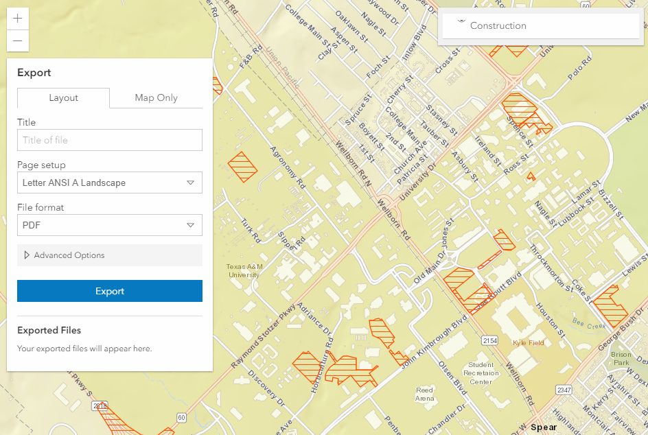
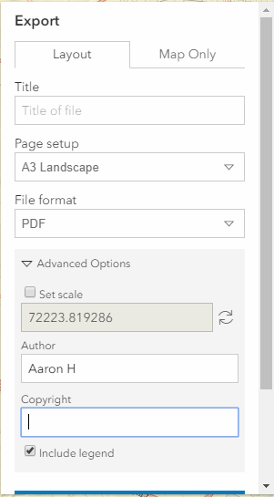

# TAMU WEBGIS
>

# Learning Objectives
>
- Interacting with geoprocessing services
- Utilizing widgets
- Creating widgets
# Geoprocessing services
Geoprocessing services are services published on an ArcServer that expose you to "the powerful analytic capability of ArcGIS". What can we do with geoprocessing services? We can take simple data from a web map or any other web application and use a geoprocess service to process said data and return a useful output. Below we will detail a few of the geoprocessing services we use with Aggiemap and what they can do.
>
## Printing
Using a print widget from ESRI JS and the URL to a **print** geoprocessing server, we can generate a sweet .pdf of our web map's current extent. Using the previous lecture's web map, we will add the **Print** module to our Dojo **require** and function parameters.
```javascript
"esri/widgets/Print"
```
With the **Print** module added, we can then create the following code to initialize a new **Print** widget. We then add the print widget to our **MapView** using the the **add()** method.
```javascript
var url = "https://gis.tamu.edu/arcgis/rest/services/Utilities/PrintingTools/GPServer/Export%20Web%20Map%20Task";
var print = new Print({
    view: view,
    printServiceUrl: url
});
view.ui.add(print, {
    position: "top-left"
})
```
With this code we should have this big ol'widget now. The other image is the expanded author options you can include.
>
  
>
[Here](../../site/wk07/map.pdf) is an example of a what you can get with the Print widget and a print geoprocessing service.
>
<!-- ## Geometry
```javascript
var url = https://gis.tamu.edu/arcgis/rest/services/Utilities/Geometry/GeometryServer;
``` -->
>
# Creating widgets
## 1. Setting up
Creating widgets can be hard, but widgets are a vital part of creating web maps that go beyond simple dots on a map. We start by creating a new directory called **Widgets** to contain all of our new widget files. Inside **Widgets**, we'll create another directory called **HelloWorld**. Open up **HelloWorld** and add a new file called **HelloWorld.tsx**. The .tsx means this is a Typescript file, but don't let that scare you off. Every widget uses Typescript to define the UI. Inside of the **Widgets** directory, create another file called **tsconfig.json**. This will tell VSCode how to compile our **HelloWorld.tsx** into normal Javascript. With **tsconfig.json** opened, we add the following:
```javascript
{
  "compilerOptions": {
    "module": "amd",
    "noImplicitAny": true,
    "sourceMap": true,
    "jsx": "react",
    "jsxFactory": "tsx",
    "target": "es5",
    "experimentalDecorators": true,
    "preserveConstEnums": true,
    "suppressImplicitAnyIndexErrors": true
  },
  "include": [
    "./HelloWorld/*"
  ],
  "exclude": [
    "node_modules"
  ]
}
```
Now that we have our configuration page up, we can go ahead and install the ArcGIS JS API typings. If you don't have **npm** installed, now is a good time to do so. In the root of our site we will run the following commands:
>
>`npm init`
>`npm install --save @types/arcgis-js-api`
>`npm install -g typescript`
>
With that completed we can now start making our widget.
>
# 2. Writing the widget
We should be setup with all the inital stuff at this point. Open up your **HelloWorld.tsx** and put the following code block inside.
>
The lines after the triple slash you can think of as a type of import statment. We then import some functionality from ESRI, then define a variable **CSS** that has some properties used inside the widget's **render()**.
>
```typescript
/// <amd-dependency path="esri/core/tsSupport/declareExtendsHelper" name="__extends" />
/// <amd-dependency path="esri/core/tsSupport/decorateHelper" name="__decorate" />

import {subclass, declared, property} from "esri/core/accessorSupport/decorators";

import Widget = require("esri/widgets/Widget");

import { renderable, tsx } from "esri/widgets/support/widget";

const CSS = {
  base: "esri-hello-world",
  emphasis: "esri-hello-world--emphasis"
};
```
Now we can create our widget's class using the following code:
>
```typescript
@subclass("esri.widgets.HelloWorld")
class HelloWorld extends declared(Widget){

}
```
What we've done is told the compiler that our class is going to be a subclass of class **Widget**. We then add properties to our widget by using some Typescript syntax. We use the **property** decorator to tell the compiler that the property is an Accessor property (allows use of **get** and **set**). The **renderable** decorator means we can automatically render the property whenever the property changes value.
```typescript
@property()
@renderable()
firstName: string = "YOURNAMEHERE";

@property()
@renderable()
lastName: string = "YOURNAMEHERE";

@property()
@renderable()
isCool: boolean = true;
```
Now let's add in some methods for this widget. We'll start by defining our **render()** which is used to *draw* our HTML for us using a type of Javascript called **JSX**. It's the same thing that React Native uses. Below you can find our **render()**:
>
```typescript
render() {
  const greeting = this._getGreeting();
  const classes = {
    [CSS.emphasis]: this.isCool
  };

  return (
    <div bind={this}
         class={CSS.base}
         classes={classes}>
    {greeting}
    </div>
  );
}
```
**render()** is the only required widget function that *MUST* be implemented and it must return a valid HTML user interface. We then implement a private function:
>
```typescript
// Private method
private _getGreeting(): string {
  return `Hello, my name is ${this.firstName} ${this.lastName}!`;
}
```
We're almost done! The last step is to add the following line at the bottom of our code to bundle up our code into an easy to consume module.
>
```typescript
export = HelloWorld;
```
>
# 3. Compiling our widget
Typescript, being a subscript of Javascript, must be compiled into Javascript before we can use it. To do this, we open up terminal or a command prompt inside the root **HelloWorld** directory where our **HelloWorld.tsx** lives, we run the following command:
>`tsc HelloWorld.tsx`
>
This command will output two files: **HelloWorld.js** and **HelloWorld.js.map**.
>
# 4. Adding our widget
Now we open up our **index.html** and add the required code to incorporate our widget. We start by adding in the CSS with a style tag:
```css
<style>
  .esri-hello-world {
    font-family: "Helvetica Neue", sans-serif;
    display: inline-block;
  }
  .esri-hello-world--emphasis {
    font-weight: bold;
  }
</style>
```
With our CSS added, we now need to create an HTML element which will act as our widget before we apply our widget to it. Inside the body of your **index.html**, add the following:
```html
<div id="widgetDiv"></div>
```
We now need to prepare our map by telling it where we can find our widget files. To accomplish this, we use the following code block:
>
```javascript
<script>
var locationPath = location.pathname.replace(/\/[^\/]+$/, "");
window.dojoConfig = {
  packages: [
    {
      name: "app",
      location: locationPath + "/Widgets/HelloWorld"
    }
  ]
};
</script>
```
Dojo should now be able to find our widget and we should be able to import our widget by adding to the Dojo's **require()**. Now add the widget to your **map.js**'s require array and fucntions parameters.
>
```javascript
"app/HelloWorld"
```
With your **map.js** still open, let's add the following:
```javascript
var names = [
    {
        firstName: "YOURNAMEHERE", lastName: "YOURNAMEHERE"
    },
    {
        firstName: "OTHERNAMEHERE", lastName: "OTHERNAMEHERE"
    },
    {
        firstName: "LASTLYNAMEHERE", lastName: "LASTLYNAMEHERE"
    }
]
nameIndex = 0;
```
We then use this to initalize our widget:
```javascript
var widget = new HelloWorld({
  firstName: names[nameIndex].firstName,
  lastName: names[nameIndex].lastName,
  container: "widgetDiv"
});
```
The last requirement is to add a function which will be called to change the widget text every second.
```javascript
function changeName() {
  widget.set(names[++nameIndex % names.length]);
}

setInterval(changeName, 1000);
```
And there you have it! Your own, custom widget.
>
# Additional resources
- https://enterprise.arcgis.com/en/server/latest/publish-services/linux/what-is-a-geoprocessing-service-.htm
- https://developers.arcgis.com/javascript/latest/sample-code/widgets-custom-widget/index.html
- https://developers.arcgis.com/javascript/
- https://developers.arcgis.com/javascript/latest/api-reference/index.html


# Questions
[Set 1](../reviewquestions/20.md)
