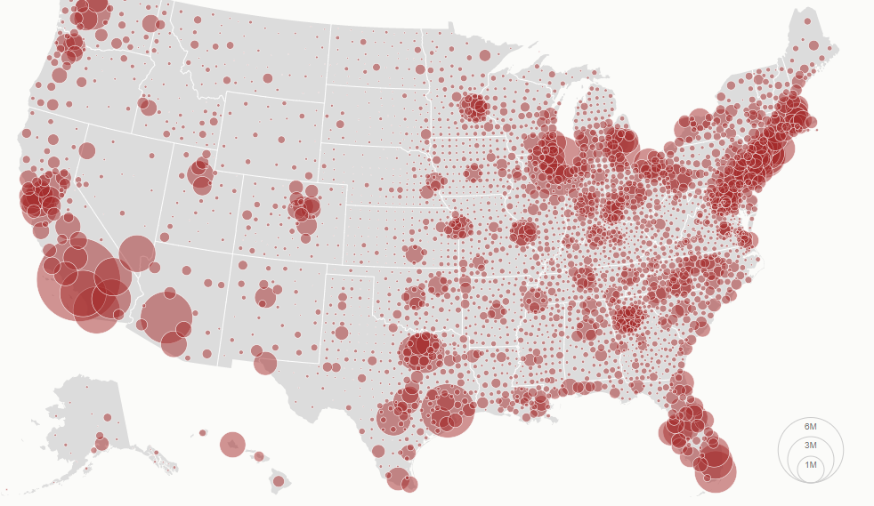
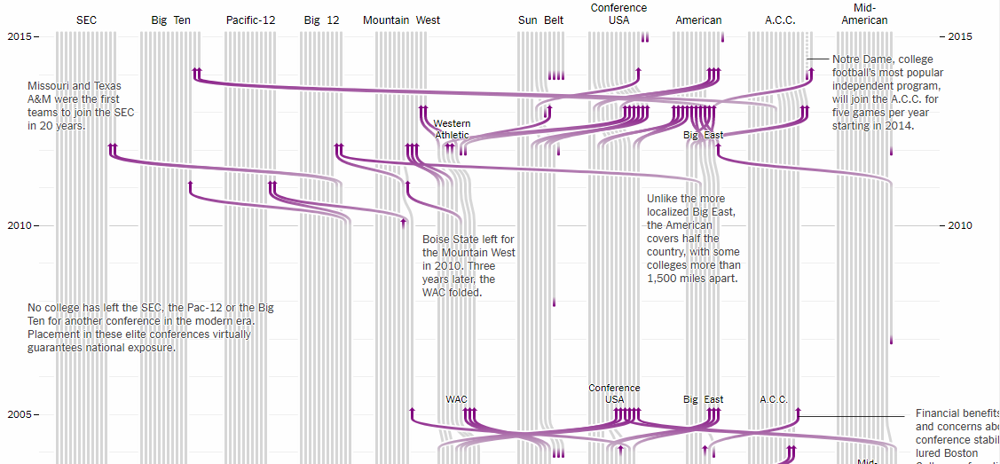

# TAMU WEBGIS
>

# Learning Objectives
>
- Explain the components of D3.js
- Implement simple D3.js visualization
# Intro to D3
D3 is a well-known Javascript visualization library used by people everywhere regardless of their industry. What is D3? Created by Mike Bostock while he was a PhD student at Stanford, D3 is an extensible, greatly configurable library used by data visualisation people. According to D3's official website, "D3 allows you to bind arbitrary data to a Document Object Model (DOM), and then apply data-driven transformations to the document." We can create many neat visualizations by utilizing D3 as shown by the screen shots below.
>
 
>
# Working with D3
Working with D3, in my opinion, is difficult. The syntax makes little sense and you'll be constantly using enigmatic D3 functions that will leave you scratching your head. But it will work, which is all that matters. Let's get at it by creating a simple bar chart using D3.
>
Start with an HTML page called **index.html**. This time around we'll be using internal **script** tags to do our Javascript instead of having to define and import a separate Javascript file. We define our normal **head** and **body** elements, along with a **div** with a class **chart**. The class is important here as we'll be telling D3 to target this particular class: any element with this class name will be affected by D3. Remember to add the D3 import inside your **head**. 
>
Now below your **div** we start a new Javascript section and put in the following:
```javascript
    var data = [30, 86, 168, 281, 303, 365];

    d3.select(".chart")
    .selectAll("div")
    .data(data)
        .enter()
        .append("div")
        .style("width", function(d) { return d + "px"; })
        .text(function(d) { return d; });
```
Since D3 binds data to DOM elements (such as div in our example), we need a data variable with values inside; the variable **data** acts as our D3 data. Below the **data** variable you have your first taste of D3-enese. We call the **d3** object (given to us by the d3js.org import in our **head**) and use the **select** method to go into our DOM and grab the element with the class name **chart**. 
>
After that first line is done executing you can imagine having a reference to your **chart** element, then ON the **chart** element, we use another D3 method called **selectAll**. We provide the type of element we wish to select inside our **chart**, which in the case, is a div with no other children. So what are we selecting? Nothing yet. D3 is smart enough to know we have data we wish to visualize and prepares for what's known as a **data join**. Long story short what this does is create a **div** inside our main div with class **chart** to then use in the following line.
>
With **selectAll** done we then have a reference to each individual div, or in this case an individual bar in our chart. This is where the **data join** occurs. We're binding the data found inside our **data** array variable to what will be newly created divs inside **chart**. Again since those divs which will act as the bars in our bar chart do not exist yet (there are still no children inside of **chart**), we use the **enter()** and **append()** functions to create a new DOM element for each value present inside our data array **data**. If we left it at that and didn't have the two lines style and text, we'd have the **chart** div with 6 children: all children divs of **chart**.
>
Now that we have a div created for each data point, we use the value inside of data to define the style of the div: in this case we're setting the width of the div to be equal to the value of the data point bound to this div. For example, the first div is bound to the value 30. This **style()** method will take the value 30 and set the width of the div element equal to 30. The second value is 86, when **style()** is called it will make width of the second div inside of **chart** equal to 86 and so on. 
>
The last function will set the text value of each div with the value bound to that div. This would look something like this:
>
```html
<div style="width: 86;">86</div>
```
And that's it! We've successfully created a static bar chart from the values using D3. The finished product should look like this:
```html
<html>
    <head>
        <script src="https://d3js.org/d3.v4.min.js"></script>

        <style>
        .chart div {
            font: 10px sans-serif;
            background-color: steelblue;
            text-align: right;
            padding: 3px;
            margin: 1px;
            color: white;
        }
        </style>
    </head>
    <body>
        <div class="chart"></div>
        <script>
            var data = [30, 86, 168, 281, 303, 365];

            d3.select(".chart")
            .selectAll("div")
            .data(data)
                .enter()
                .append("div")
                .style("width", function(d) { return d + "px"; })
                .text(function(d) { return d; });
        </script>
    </body>
</html>
```
>

>
# Additional resources
- https://www.highcharts.com/demo
- https://github.com/d3/d3/wiki/Gallery
- https://bost.ocks.org/mike/bar/

# Questions
[Set 1](../reviewquestions/23.md)

## Videos
[Video 1 - 2018-03-07](https://youtu.be/E88FI6lIph4) - goes through 28 mins
[Video 2 - 2018-03-07](https://youtu.be/CgnPezwrBKk) - goes through 28 mins