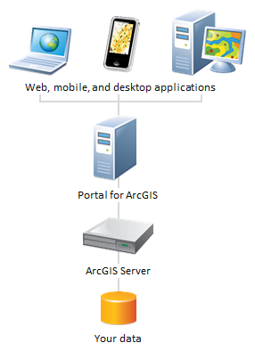
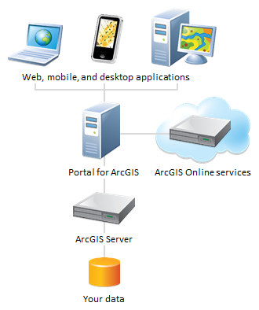
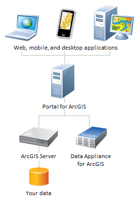

# TAMU WEBGIS
>

# Learning Objectives
>
- [Describe the components of ArcGIS Portal](https://enterprise.arcgis.com/en/portal/latest/install/windows/what-is-portal-for-arcgis-.htm)
- [Describe the benefits that ArcGIS Portal provides](https://enterprise.arcgis.com/en/portal/10.4/use/what-is-portal-for-arcgis-.htm)
- [Describe the role of ArcGIS Portal in the ArcGIS platform](https://enterprise.arcgis.com/en/portal/latest/install/windows/the-portal-s-role-in-arcgis.htm)
- [Describe the apps that ArcGIS Portal supports](https://enterprise.arcgis.com/en/portal/latest/administer/linux/manage-app-launcher.htm)
- Describe the role of ArcGIS Portal in an organization
>#### All text from ESRI

# What is Portal for ArcGIS
Portal for ArcGIS is a component of ArcGIS Enterprise that allows you to share maps, scenes, apps, and other geographic information with other people in your organization. The front-end ArcGIS Enterprise portal is powered by the back-end infrastructure of Portal for ArcGIS. The portal administrator can customize the ArcGIS Enterprise portal to fit your organization's look and feel.
>
The ArcGIS Enterprise portal brings together all the geographic information in your ArcGIS platform and shares it throughout your organization. With it, you can:
- Create, save, and share web maps and scenes.
- Create and host web mapping apps.
- Search for GIS content within your organization.
- Create groups to share GIS information with colleagues.
- Share links to GIS apps.
- Share map and layer packages to use in ArcGIS Desktop
>
The ArcGIS Enterprise portal makes GIS accessible for users of all experience levels. Geographic viewers are designed for those who are just beginning with GIS, while experienced GIS users can connect to the portal from ArcGIS Desktop, developer APIs, and other applications.
# Portal for ArcGIS components
- The ArcGIS Enterprise portal website — At the front end of the portal, users sign in to search, use, and share content.
- Map Viewer — This app within the portal website allows you to view, design, and save web maps. Think of it as a canvas in which you combine GIS information and services to make your own map. You can save your maps, share them with others, and embed them in apps you create using configurable app templates or Web AppBuilder for ArcGIS.
- Web AppBuilder for ArcGIS — The portal website includes an embedded interactive app for designing and building web applications from your web maps. Applications you create with Web AppBuilder require no programming knowledge and are HTML-based, meaning they work on desktop browsers, tablets, and smartphones without needing a plugin. Web AppBuilder comes with a variety of themes you can customize and widgets that allow you to deliver advanced functionality such as high-quality printing, geoprocessing, editing, and search. To learn more, see About Web AppBuilder for ArcGIS.
- Activity Dashboard for ArcGIS — The website includes an embedded app that reports various usage statistics for items, users, and groups. Portal administrators can use this information to monitor reports, information, and metrics detailing activities in the organization. To learn more, see About usage reports.
- Scene Viewer — In the ArcGIS Enterprise portal, the Scene Viewer application is used for viewing 3D geospatial content. Scene Viewer works with desktop web browsers that support WebGL, a web technology standard for rendering 3D graphics.
- ArcGIS apps — Portal for ArcGIS supports user-friendly applications that allow people to interact with web maps and scenes from your ArcGIS Enterprise portal. For a full list of portal-ready applications, see Common clients of Portal for ArcGIS.
- Living Atlas of the World content — By default, portals are configured to access Living Atlas of the World content provided by Esri. Living Atlas content is available to ArcGIS Enterprise portals in connected and disconnected environments; to learn more, see Configure Living Atlas content.
- Administrator tools — The ArcGIS Enterprise portal website includes administrator tools that allow management of users, groups, and content. Only members of the portal who have administrator privileges can see these options when they sign in to the website.
- ArcGIS Portal Directory — The ArcGIS Portal Directory is an interactive view of the ArcGIS REST API's resources for working with the portal. For example, some administrative tasks such as unregistering the ArcGIS Web Adaptor (IIS), updating the location of the portal's content directory, and setting the identity store are all available in the ArcGIS Portal Directory. To learn more, see About the ArcGIS Portal Directory.
# Portal's role in ArcGIS platform
Portal for ArcGIS plays a central role in organizing and sharing information within your ArcGIS system. The portal provides a user-friendly, searchable repository for your maps and apps. It also helps you create and share new maps and apps.
>
Some of the rich information in these maps and apps originates from a database within your organization. The GIS content in this database is shared with other devices using web services hosted by ArcGIS Server. The portal helps map and app creators to find and use these web services. The portal provides an easy window into your GIS content without requiring GIS software training.
>

>
Some organizations publish a full suite of web services that can be used to create a fully homegrown app using proprietary data. However, in many cases you might want to supplement your own services with detailed basemaps, place finders, address finders, and other GIS web services from ArcGIS Online. In this scenario you combine your own ArcGIS Server services with services that are hosted and continuously updated in the Esri cloud.
>

>
If your maps and apps don’t have internet access, you can use the Data Appliance for ArcGIS to supply the same basemaps, address finders, and other web services that you would ordinarily find on ArcGIS Online. This type of deployment can be hosted completely behind your organization’s firewall.
>

>
If you want to support a combination of internal and external users, you might deploy two portals: one behind your firewall and one that is exposed to the web. This works well when you want full control over the data location and updates, or if your data is not allowed to be hosted offsite. An alternative is to use an organizational subscription to ArcGIS Online for your external-facing apps and services.
# Portal Apps
You can create an app with a shared map using a configurable app template or Web AppBuilder. Different templates and Web AppBuilder offer various bits of functionality, such as layouts and color schemes, editing and identify tools, social media feeds, and side-by-side map viewers. Choose a configurable app template or open Web AppBuilder from Map Viewer, My Content, or the item page. Then configure the components and publish the app. Another way to create an app is to download a template and deploy it to your organization's web server.
>
A published web app is based on a map authored with Map Viewer. Any changes the author makes to the map, including its extent, layers, description, and so on, are reflected in the web app. If a map that was available to everyone in the organization is made private (or deleted), the map no longer appears in the app
# Portal's role in your organization 
## 9:30 a.m.
Randall, the GIS manager, meets with the organization's directors to discuss opening a new office at one of five potential properties in the region. The directors want a map that shows each property, along with some detailed information such as tax assessments, soil surveys, and local hazards. The directors tell Randall that they need a web map showing this information on the portal website because they'll be presenting this to the CEO, Linda, at the end of the day.

## 10:30 a.m.
Randall sends an email to Nicole, a GIS analyst, the details of the project and a CSV file of the property and tax assessment information. Nicole opens the CSV file and notices that there is address information for each property.
>
Instead of opening ArcMap to make a map, she drags and drops the spreadsheet into Map Viewer in the portal. A map is created of the five properties along with the other data in the spreadsheet.
>
To make the map more attractive, Nicole configures a pop-up window for each property location and filters the information to display the statistics and tax information Randall specified in his email. Nicole knows that there are two other map services hosted on their internal ArcGIS Server site that include local hazards and recent soil surveys of the properties. She adds these services to the map.
>
Nicole saves the web map and shares it with a group within the organization called Property Assessment. Randall and the directors are all members of this group. Nicole replies back to Randall's original email and includes a URL to the completed map.
## 1:00 p.m.
Randall returns from lunch and sees the email from Nicole. He opens the web map and reviews the content. It contains all the information the directors need. He inserts the web map into a Microsoft PowerPoint slide using ArcGIS Maps for Office. He then forwards the PowerPoint slide along to the directors for use in their meeting with the CEO.
## 3:00 p.m.
Linda steps into a meeting with the directors where they discuss a wide range of items, in which one of them includes property assessments for the new office location. In their PowerPoint, they go to a slide that displays a map of the properties along with the soil surveys and local hazards. One of the directors clicks the play button at the top left corner of the slide and the map transforms into a live web map.
>
As the director pans and zooms, Linda is able to see detailed local information for each property. After a few minutes, Linda determines that property number three is the best candidate for the new office location. The directors agree, and they move on to other items.

# Questions
[Set 1](../reviewquestions/30.md)

#Videos
[Video 1 - 2018-04-09](https://youtu.be/7ofz28eu2p4) - Through 33 mins
[Video 2 - 2018-04-09](https://youtu.be/S8l8DB_88kc) - Through 33 mins
